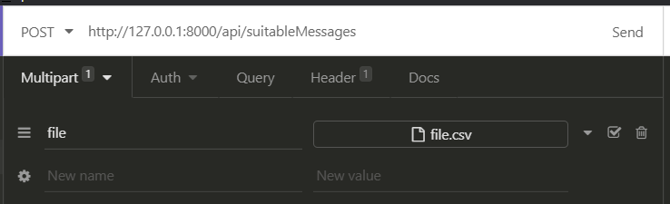

<p align="center">
    <a href="https://laravel.com" target="_blank">
        
    </a>
</p>

## Passos para Instalação

```
git clone git@github.com:fabioversaobeta/api-mensagens.git
```

```
cd api-mensagens
```

```
composer install
```

```
php artisan serve
```

## Testes unitários

```
php artisan test
```

## Passos Testar

utilizar arquivo texto com o conteúdo semelhante

```
bff58d7b-8b4a-456a-b852-5a3e000c0e63;12;996958849;NEXTEL;21:24:03;sapien sapien non mi integer ac neque duis bibendum
b7e2af69-ce52-4812-adf1-395c8875ad30;69;949360612;CLARO;19:05:21;justo lacinia eget tincidunt eget
e7b87f43-9aa8-414b-9cec-f28e653ac25e;34;990171682;VIVO;18:35:20;dui luctus rutrum nulla tellus in sagittis dui
c04096fe-2878-4485-886b-4a68a259bac5;43;940513739;NEXTEL;14:54:16;nibh fusce lacus purus aliquet at feugiat
d81b2696-8b62-4b8b-af82-586ce0875ebc;21;983522711;TIM;16:42:48;sit amet eros suspendisse accumsan tortor quis turpis sed ante
```

```
Com o Postman, Insomnia ou equivalentes:
Criar uma requisição preenchendo conforme imagem abaixo

method: POST 
structured: Multipart Form
url: http://127.0.0.1:8000/api/suitableMessages
field: file
```



## Ferramentas utilizadas

```
Language: PHP 7.3.15
Framework: Laravel Framework 8.6.0
IDE: Visual Studio Code 1.49.2
SO: Windows 10 
REST API Client: Insomnia 2020.4.1
```
